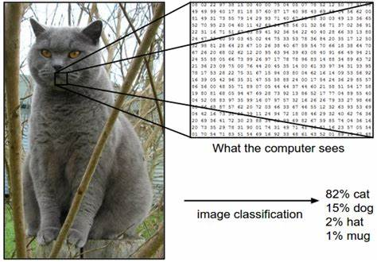
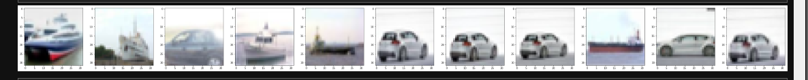

# CS-231n Winter 2016 ( Convolutional Neural Networks for Visual Recognition )

Have a look at [Course-Description](http://cs231n.stanford.edu/)

   #### **`Cs-231n encountered its second series in 2016 taught by Prof Lei Fei Fei and Andrej Karpathy at Stanford University.`**

## Lecture 1 : Data-driven approach, kNN, Linear Classification

**1. Python** 

First of all, understanding the process of building neural networks requires a basic understanding of Python. I have compiled some important fundamentals in [Python_Basics.py](https://github.com/kamranisg/CS231n-Andrej_Karpathy_Stanford/blob/master/Python_Basics.py) to get started.

Useful Links to get started :

- [Python-Numpy Tutorial of CS-231N](http://cs231n.github.io/python-numpy-tutorial/)
- [Python-Lists](https://docs.python.org/3.5/tutorial/datastructures.html#more-on-lists)
- [Python-Dictionaries](https://docs.python.org/3.5/library/stdtypes.html#dict)
- [Python-Sets](https://docs.python.org/3.5/library/stdtypes.html#set)
- [Python-Tuples](https://docs.python.org/3.5/tutorial/datastructures.html#tuples-and-sequences)
- [Numpy](https://numpy.org/)

**2. Image Classification- A core task in Computer Vision**

`An image is composed of a 2d matrix of numbers also called pixels . For a colored picture we have 3 layers of Red, Green, Blue 2d matrices stacked together one by one.`

What is Data Driven Approach ? 

  1. Collect a dataset of images and labels.
  2. Use Machine Learning to train an image classifier.
  3. Evaluate the classifier on a withheld set of images.
  
  Lets start :
  
  **Classifier 1: K Nearest Neighbor**
  
 `Dataset: CIFAR 10,
  Labels : 10,
  Training Images : 50000,
  Test Images : 10000`
  
  - Approach 1 : Manhatten Distance 
                 
     1.Import Dependencies
      
         import tensorflow as tf
         from tensorflow.keras.datasets import cifar10
         import matplotlib.pyplot as plt
         import numpy as np
        
     2.Load Data
     
         (x_train,y_train),(x_test,y_test)=cifar10.load_data()
        
     3.Finding 10 closest images
     
         a=np.array(x_train.reshape(50000,3072)) #Reshaping training data
         
         b=a-np.array(x_test[1].reshape(1,3072)) # Calculating Manhattan Distance from x_test[1](SHIP) with training data
         
         c=np.sum(b,axis=1) # Row wise summation
         
         index=np.argpartition(c,10) 
         s=c[index[:10]] # Finding the 10 closest images
         
         fig=plt.figure(figsize=(60,60))

         fig.add_subplot(2,12,1)
         plt.imshow(x_test[1]) # TESI IMAGE
         
         for i in range(1,11):
            fig.add_subplot(2,12,i+1)
            d=np.where(c==s[i-1])
            plt.imshow(x_train[d[0]][0])
     
     
     
     #### Result 
     
     Manhattan distance performs poorly on getting similar images as many images are wrongly classified here.
     
     Check my [CIFAR-10-Manhatten.py](https://github.com/kamranisg/CS231n-Andrej_Karpathy_Stanford/blob/master/CIFAR-10-Manhatten.ipynb) code for detailed implementation with some more examples 
     
## Lecture 2 : Linear Classification 2, Optimization

  
